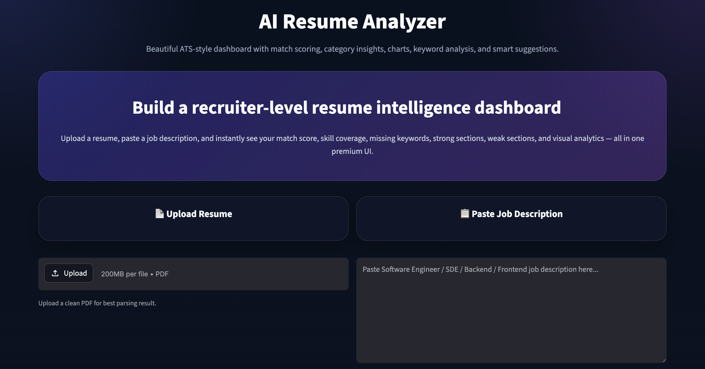
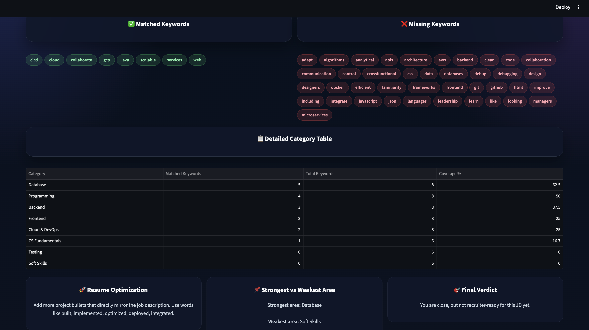
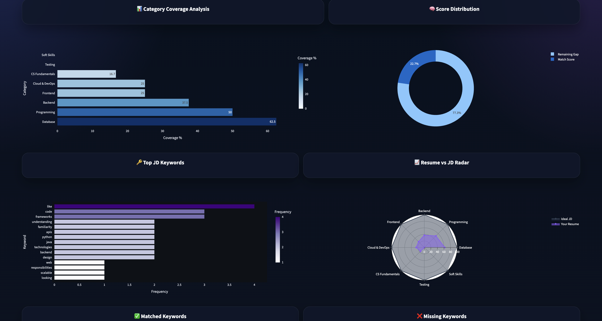

# AI Resume Analyzer

An intelligent AI-powered Resume Analyzer that evaluates resumes based on job descriptions, providing ATS-style scoring, keyword analysis, and visual insights.

## 🌐 Live Demo

https://ai-resume-analyzer-bkqzejw8rurmwgqyir8kuz.streamlit.app/

---

## Features

-  Upload Resume (PDF)
-  Paste Job Description
-  Match Score (ATS-based)
-  Skill-wise Analysis
-  Interactive Graphs & Charts
-  Missing Keywords Detection
-  Smart Suggestions
-  Domain-wise Scoring (Data Science, Web, ML, etc.)

---

##  How It Works

1. Resume text is extracted using NLP techniques  
2. Job description is analyzed  
3. Keywords are matched  
4. Score is generated  
5. Graphs & insights are displayed  

---

##  Tech Stack

- Python 
- Streamlit 
- Pandas 
- Matplotlib 
- PyPDF2 
- Scikit-learn 

---
###  Dashboard


###  Resume Analysis


###  Graphs & Insights

---

Daily improvement by vijay.

## ⚡ Installation & Run

```bash
git clone https://github.com/YOUR-USERNAME/AI-Resume-Analyzer.git
cd AI-Resume-Analyzer
pip install -r requirements.txt
python3 -m streamlit run app.py
